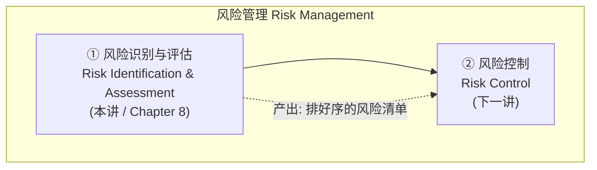
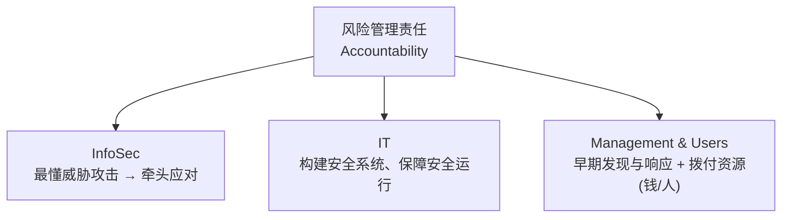
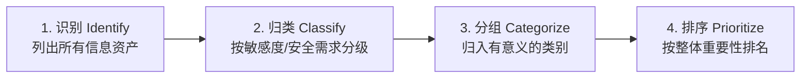
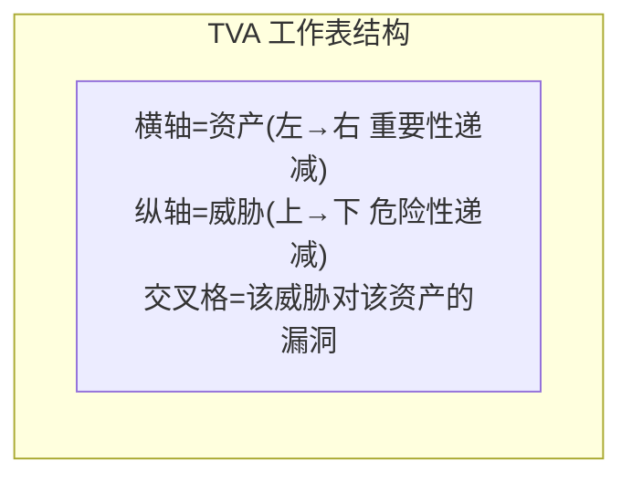
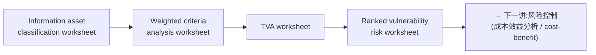

# Week 9 · 风险管理:识别与评估风险 (Risk Management: Identifying and Assessing Risk)

> **学习目标 (Learning objectives)** — 读完本章你应该能够:
> - **定义** risk management(风险管理)及其在组织中的角色,并说清它和 risk identification / risk assessment / risk control 的关系
> - **描述** 用来识别和排序 information assets(信息资产)风险的技术——尤其是 weighted factor analysis(加权因子分析)
> - **解释** 风险是如何基于"不利事件发生的可能性 (likelihood)"和"事件发生时对资产的影响 (impact)"来评估的
> - **计算** 单个 vulnerability 的相对风险评分,套用 $R=(L_v\times I)\times(1-RC+U)$ 这个公式
> - **讨论** 风险识别过程的产出(TVA 工作表、ranked vulnerability risk worksheet)如何被用于下一步的风险控制

> 📎 **参考** — 本章对应教材 **Chapter 8**。下一讲(Week 10)讲 **risk control(风险控制)**,即拿到本讲的风险清单后"怎么办"。本讲只解决"有哪些风险、各有多严重"。

信息安全部门(InfoSec department)存在的根本理由,其实只有一句话:**管理由信息和 IT 带来的风险**。注意这里说的是"管理"而不是"消灭"——任何组织只要运转,就一定有风险:招人有风险、卖产品有风险、连决定把办公楼盖在哪儿都有风险。风险无法清零,只能被认识、被排序、被控制到组织愿意接受的程度。于是问题就变成:**面对成百上千的资产和威胁,管理者该把有限的钱和人手优先投到哪里?** 本章就是回答这个问题的前半部分——先把风险一条条找出来(identify),再给每条风险打个分(assess),这样下一讲做控制时才有的放矢。

整个风险管理由**两个正式流程 (two formal processes)** 组成,本讲只覆盖第一个:

---

## 一、谋定而后动:三个 community of interest 与孙子兵法

在动手识别风险之前,先要明确**谁来负责**。回忆第一讲讲过的概念:信息安全里有三个**利益共同体 (communities of interest)**,本讲再次强调每个共同体在"降低风险"这件事上各自的角色。把它们的分工记清楚,因为考试常考"某项责任归谁":

| Community of interest | 在风险管理中的角色 | 一句话记忆 |
|---|---|---|
| **General management(高层/总体管理)** | 设计 IT 与 InfoSec 的组织结构,确保资产被成功防御;并**拨付足够的钱和人** | 定大局、给资源 |
| **IT management(IT 管理)** | 构建并安全运行系统,把运营风险考虑进去并实施恰当控制 | 把系统造安全、跑安全 |
| **InfoSec management(信息安全管理)** | 因为最懂威胁和攻击,所以在应对风险中**带头 (leadership role)**;同时在 InfoSec 的"安全"与业务的"可用"之间不断权衡 | 当先锋、做权衡 |

讲到这里,讲者引用了 2400 多年前**孙子 (Sun Tzu)** 的一句话,作为整章的思想主线。这不是装饰——它精确地概括了风险识别的两半工作:

> "**知彼知己,百战不殆;不知彼而知己,一胜一负;不知彼不知己,每战必殆。**"
> (If you know the enemy and know yourself, you need not fear the result of a hundred battles…)

把这句话翻译到信息安全里:

- **知己 (Knowing Yourself)** = 摸清自己有哪些**有价值的信息资产**,把它们识别、归类、分级,并搞清当前是怎么保护的。一个组织若连自己有什么、值多少都不知道,根本无从谈保护。
- **知彼 (Knowing the Enemy)** = 识别、审视并理解**威胁 (threats)**——哪些威胁真的会攻击我的资产、它们的攻击手法是什么。

这恰好对应本讲的两大块:**资产侧(知己)**和**威胁侧(知彼)**,最后在"漏洞"处交汇。这里顺便把两个会被考到的正式定义钉死:

> **📖 定义** — **风险管理 (risk management)**:发现并评估组织运营所面临之风险、并决定这些风险该如何被**控制或缓解 (controlled or mitigated)** 的过程。**风险分析 (risk analysis)**:对组织内**风险等级 (levels of risk)** 的识别与评估,它是风险管理的一个**主要组成部分**。换句话说,risk analysis 是 risk management 内部的一块。

> 📎 **拓展(超出 slides)** — 为什么强调"风险管理是一个 process(过程)而非一次性项目"?幻灯片只点了一句"not install-and-forget"。背后的道理是:威胁环境一直在变(新漏洞、新攻击、新业务),今天评估出来的风险等级几个月后可能完全不同。所以风险识别和评估不是做一次就归档,而是要**周期性重做**。这也是为什么后面所有产出都做成"worksheet(可更新的工作表)"而不是"一次性报告"。

### 谁对风险负责 (Accountability)

三个共同体都担责,但各有侧重——这页(S8/S9)很容易出选择题:

三个共同体必须**协同**,覆盖从"全面灾难"到"一名员工的小失误"的每个风险层级。具体要共同参与这些活动(记其中的动词链条):**评估控制措施 → 判断哪些控制方案最划算 (cost-effective) → 采购/部署控制 → 监督控制持续有效 → 识别风险 → 评估风险 → 汇总结论 (summarize findings)**。其中"识别风险"和"评估风险"就是本讲的两大主题,下面逐一展开。

---

## 二、风险识别 (Risk Identification):先把家底盘清楚

**风险识别 (risk identification)** 的正式定义是:**对组织信息资产所面临风险的识别、列举与记录 (the recognition, enumeration, and documentation of risks)**。它是风险管理的**第一个操作阶段 (first operational phase)**。

这里要先定义一个贯穿全章的核心名词。**信息资产 (information asset)** 指:**任何收集/存储/处理/传输对组织有价值之信息的集合、数据库或资产**。注意这个定义比"数据库"宽得多——它包括人、流程、软硬件、网络设备,任何"承载有价值信息"的东西都算。

风险识别从**自我审视 (self-examination)** 开始,管理者要做四步,顺序很重要:

下面把这四步逐一讲透。

### 2.1 识别信息资产 (Identifying Information Assets)

第一步是把所有资产列出来,资产分六大类:**people(人)、procedures(流程)、data(数据)、software(软件)、hardware(硬件)、networking elements(网络元素)**。

这一步有个关键原则:**先列出来,不要急着判断价值 (without pre-judging the value)**。价值在后面的步骤才赋予。为什么?因为如果一边列一边主观打分,容易漏掉那些"看起来不重要、实则关键"的资产。

讲者把这六类资产进一步细分,这套细分值得记住(它体现了"为什么要分得这么细"):

| 资产类别 | 细分 | 为什么这样分 |
|---|---|---|
| **People** | 内部人员 vs 外部人员;内部再分"受信任角色(权限大、责任大)"vs"普通员工" | 不同信任级别带来的风险不同 |
| **Procedures** | 标准流程 vs **敏感流程 (sensitive procedures)** | 敏感流程可能泄露关键流程的内部运作,被外人利用 |
| **Data** | 处于传输/处理/存储三种状态的信息 | "data"在此是广义,不只是数据库 |
| **Software** | 应用 / 操作系统 / **安全组件 (security components)** | 安全组件属于受控环境,要比普通软件保护得更严 |
| **Hardware** | 普通用户设备 vs 属于安全受控系统的设备 | 后者要保护得更严 |
| **Networking** | 防火墙、路由器、交换机及其内嵌系统软件 | 常是攻击焦点,需单独考虑而非并入硬件 |

> **🔑 例(敏感流程为何危险)** — 一家电信公司"开通新线路"的操作流程,看似平常,但它揭示了一个关键业务的内部运作细节。外部人员一旦拿到这套流程,就可能据此非法开通服务、窃取通信资源。所以同样是"流程",它的风险等级远高于普通行政流程。

> 📎 **拓展(超出 slides)** — 为什么网络设备要从硬件里**单独拎出来**?讲者举了个精妙的例子:同一台服务器,如果纯粹当代理/缓存(proxy/cache)用,功能上更像网络设备,就归为 networking;但如果配成数据库服务器,就归为 hardware。判断标准是"它主要在干网络的活还是计算的活"。这说明分类不是看物理外形,而是看**功能角色**。

> 📎 **拓展(超出 slides)** — 有些企业模型把六类**简化为三类:people、processes、technologies**。无论用哪种模型,核心要求都一样:确保所有信息资源都被正确识别、评估、纳入风险管理。

### 2.2 该记录资产的哪些属性 (Asset Attributes)

光知道"有一台路由器"不够,还得记录它的**属性 (attributes)**,这样日后分析漏洞时才能精确定位。很多组织用**资产清单系统 (asset inventory system)** 自动跟踪硬件、软件、网络组件;没有的话就得建一套等价的手工流程。无论自动还是手工,都要先规划:**到底跟踪每个资产的哪些属性?** 这取决于组织的需求和风险管理目标。

针对**硬件/软件/网络资产**,可选属性包括:

- **Name(名称)** —— 列出所有常用名并交叉引用;但要采用**不向攻击者泄露关键信息的命名规范**(别把服务器命名为 `PAYROLL-DB-PROD`)。
- **Asset tag(资产标签)** —— 采购时分配的唯一编号,便于跟踪。
- **IP address** —— 对网络设备和服务器有用,对软件几乎不适用;且因 DHCP **动态分配**,IP 常变,作为标识不可靠。
- **MAC address** —— 网卡的硬件唯一编号,但**可被伪造 (spoofed)**,且一台设备可能有多个网卡/可配置 MAC,所以很多组织已弃用它作为唯一标识。
- **Asset type(资产类型)**、**Serial number(序列号)**、**Manufacturer name(厂商名)**、**Model/part number(型号/部件号)** —— 后几项在分析漏洞时尤其有用,因为很多漏洞**只针对特定型号或特定软件**。
- **Software version / update revision / FCO number** —— FCO 即 **Field Change Order(现场变更单)**,指厂商上门给硬件升级。
- **Physical location(物理位置)** 与 **Logical location(逻辑位置,在网络中的位置)**。
- **Controlling entity(控制方)** —— 哪个组织单元控制此资产。这点重要:**控制方对"这设备能承受多少风险、能花多少钱加控制"有发言权**。

> **🔑 例(一个设备多个版本号)** — 一台防火墙设备可能同时挂着**三个版本号**:BIOS/固件版本、运行的操作系统版本、防火墙应用软件版本。组织得决定跟踪其中哪几个,因为漏洞公告往往只针对其中某一层。这就是"为什么属性要记这么细"的现实理由。

针对**人、流程、数据**这类资产,负责识别和评估的应当是**具备相应知识、经验和判断力的管理者**(它们不像硬件那样一目了然)。记录系统要**灵活**,允许按资产性质链接不同属性。基本属性如下:

| 资产 | 基本属性 |
|---|---|
| **People** | 职位名/编号/ID;主管名/编号/ID;**安全许可级别 (security clearance)**;特殊技能 |
| **Procedures** | 描述;预期用途;关联的软硬件/网络;参考存放位置;更新存放位置 |
| **Data** | 分类等级;所有者/创建者/管理者;数据结构大小与类型;在线/离线;位置;**备份流程** |

> 📎 **拓展(超出 slides)** — 注意人/流程的属性里反复强调"用编号/ID 而非姓名、职位、角色名"。原因是姓名和职位会**歧义或变动**(同名、调岗),而编号是稳定唯一的标识。大组织往往只对最关键的少数资产做完整跟踪(比如任务关键服务器),桌面机干脆不追——抓重点是务实的做法。

### 2.3 归类与分级 (Classifying and Categorizing)

资产列完后,要审视这些**类别是否对风险管理有意义**,并反映每个资产的**敏感度与安全优先级**。这就需要一套**分类方案 (classification scheme)**,按敏感度和安全需求给资产分级,每一级对应一种保护强度。

一个典型的三级方案:**Confidential(机密)/ Internal(内部)/ Public(公开)**。

> 📎 **拓展(超出 slides)** — 讲者特意对比:第三讲(访问控制)里讲过美国军方的**五级**分类;但大多数普通组织**三级就够了**。对人员这类资产,可能要用另一套方案——按"need to know(知必所需)"和"right to update(更新权限)"给予安全许可级别。

这一步有个**铁律**,极易考填空/判断:分类类别必须**全面且互斥 (comprehensive and mutually exclusive)**。

- **Comprehensive(全面)** = 每个被盘点的资产都**必须能归入某一类**(没有"无处安放"的资产)。
- **Mutually exclusive(互斥)** = 每个资产**只能落在一个类别**里(不能脚踩两条船)。

> **🔑 例(互斥/全面的实战)** — 某组织有个 **PKI 的证书颁发机构 (Certificate Authority, CA)**。纯按技术标准,它只是"软件",可能被随手归入普通软件类、不享受特殊保护。但 CA 提供密钥管理、是基础设施的核心,必须严密保护。所以正确做法是把它归入**更高优先级的"软件安全组件"类**——前提是要先确认这个类别已存在且不与其他类重叠。这正是"全面 + 互斥"两条原则在指导分类决策。

### 2.4 给资产赋值 (Assessing the Values of Information Assets)

识别、归类、分级之后,要给每个资产赋一个**相对价值 (relative value)**。注意是"相对"——我们往往无法预知"资产被攻破会损失多少绝对金额",但**相对比较**足以保证**最有价值的资产被优先保护**。

讲者给了一组用来判断相对价值的**问题清单**,每个问题背后都有讲究:

| 评估问题 | 关键辨析 |
|---|---|
| 哪个资产对组织**成功最关键 (most critical)**? | 对照组织的**使命陈述 (mission statement)** 判断哪些资产支撑目标 |
| 哪个资产产生**最多收入 (most revenue)**? | 非营利组织则看"对服务交付有多关键" |
| 哪个资产带来**最高利润 (highest profitability)**? | **利润 ≠ 收入**!有些系统收入高但利润薄甚至不盈利 |
| 哪个资产**最贵 (most expensive to replace)**? | 独特/长交付周期的设备需备份并定期测试 |
| 哪个资产**最难保护 (most expensive to protect)**? | 此阶段只能做初步估计,因为控制成本还没算出来 |
| 哪个资产丢失/泄露会**最丢脸或带来最大法律责任**? | 涉及组织形象 |

> **🔑 例(收入 vs 利润)** — 讲者用 Amazon.com 讲清这个易混点:有的服务器支撑图书销售,有的支撑拍卖,有的支撑"图书评论数据库"。评论数据库**本身不直接产生利润**,但它对销售有间接价值——所以要分清"哪些资产直接挣钱"和"哪些资产虽不挣钱却支撑挣钱的资产"。再如造飞机发动机的厂商,会判定**装配线的过程控制系统**是头等重要,而收发货的数据录入台次之(因为后者有替代方案)。

> 📎 **拓展(超出 slides)** — 这里可以回链第四讲的 **BIA(Business Impact Analysis,业务影响分析)**:赋值时直接复用 BIA 收集的信息,能让"资产值多少"的判断更有依据。这就是各讲之间的衔接——风险识别不是凭空打分,而是站在前面工作的肩膀上。

### 2.5 排序:加权因子分析 (Weighted Factor Analysis)

风险识别的**最后一步**是把资产**按重要性排序**。工具是**加权因子分析工作表 (weighted factor analysis worksheet)**:给每个资产、在每个关键因子上打分,因子各有权重,加权求和得到总分。

这是本章第一个需要会**手算**的地方。规则:每个因子有权重(本例三因子权重 30/40/30,合计 100),每个资产在每个因子上打 0.1–1.0 的分(也可用 1–10 或 1–100),**加权分 = Σ(因子得分 × 因子权重)**。

> **🔑 例(讲者亲算的 75 分)** — 资产"EDI document set 1",三个因子得分与权重:
>
> | 因子 | 权重 | 资产得分 | 贡献 |
> |---|---|---|---|
> | Impact on revenue(对收入) | 30 | 0.8 | $0.8\times30=24$ |
> | Impact on profitability(对利润) | 40 | 0.9 | $0.9\times40=36$ |
> | Impact on public image(对形象) | 30 | 0.5 | $0.5\times30=15$ |
> | **加权总分** | | | $24+36+15=\mathbf{75}$ |
>
> 对照:若某资产在三项都拿满分 1.0,则加权分 = $30+40+30=100$(本例中 "customer order via SSL inbound" 就是 100 分的最重要资产);而最不重要的资产("supplier fulfillment advice inbound")只有 41 分。**算出来的分数本身没有绝对意义,价值在于横向排序。**

至此**知己**部分完成:我们有了一份**按重要性排好序的资产清单**。接下来转向**知彼**。

---

## 三、威胁评估 (Threat Assessment):知彼的第一步

风险识别的终极目标,是审视每个资产的处境以**暴露其弱点 (vulnerabilities)**。但这里有个工程难题:一个组织面临的威胁种类繁多,**如果假设"每种威胁都会攻击每个资产",项目规模会爆炸**(威胁数 × 资产数)。

解决办法很关键:**把"威胁识别"和"漏洞识别"分开管理,最后再交汇 (managed separately, then coordinated at the end)**。先单独把威胁理清楚,这就是**威胁评估 (threat assessment)**。

### 3.1 十二类威胁 (12 Categories of Threats)

回忆第三讲讲过的 **12 类信息安全威胁(教材 Table 8-3)**。每一类都对 InfoSec 提出独特挑战,必须用专门的控制去针对其攻击手法。它们按字母序列出:

| # | 威胁类别 (Threat category) |
|---|---|
| 1 | Compromises to intellectual property(知识产权受损) |
| 2 | Deviations in quality of service from service providers(服务商服务质量偏差) |
| 3 | Espionage or trespass(间谍或非法入侵) |
| 4 | Forces of nature(自然力量) |
| 5 | Human error or failure(人为错误或失误) |
| 6 | Information extortion(信息勒索) |
| 7 | Sabotage or vandalism(蓄意破坏) |
| 8 | Software attacks(软件攻击) |
| 9 | Technical hardware failures or errors(硬件故障) |
| 10 | Technical software failures or errors(软件故障) |
| 11 | Technological obsolescence(技术过时) |
| 12 | Theft(盗窃) |

在评估之前,每种威胁都要进一步审查,判断它**对目标资产的潜在影响**——这个审查过程就叫 threat assessment。

### 3.2 评估威胁:八个问题 (Assessing Threats)

不是每种威胁都危及每个组织。先**逐类审视,剔除不适用的威胁**(虽然很难整类剔除,但能加速后续评估)。一个威胁的危险程度有时很难判断,可借助下面这组问题——每个问题背后的逻辑都要懂:

| 评估问题 | 背后逻辑 |
|---|---|
| 这威胁对我的资产构成**真实危险**吗? | 没有真实暴露的威胁可安全忽略(如高地组织不必担心海啸/泥石流;不用某软件就不必担心它的漏洞) |
| 是**内部**还是**外部**威胁? | 来源不同,防御手段不同 |
| 哪些威胁**发生概率最高 (probability of occurrence)**? | 取决于攻击有多广为人知、有多少威胁主体有能力实施 |
| 哪些威胁**成功概率最高 (probability of success)**? | 攻击越复杂、越需要高水平攻击者,组织越不必过度担心 |
| 哪些威胁成功后**损失最大 (greatest loss)**? | "高成功率+小损失" < "低成功率+巨大损失" 值得警惕 |
| 组织**最没准备 (least prepared)** 应对哪些威胁? | 上新技术/新业务时尤其要警惕 |
| 防护哪些威胁**最贵 (cost to protect)**? | 中小企业预算有限,优先级可能直接由可用资金决定 |
| 从哪些威胁中**恢复最贵 (cost to recover)**? | 可用 1–5 打分(1 便宜、5 极贵),或填入真实金额 |

> 📎 **拓展(超出 slides)** — 注意"发生概率最高"和"成功概率最高"是两个不同的问题:前者问"我会不会被这种威胁盯上",后者问"一旦被盯上,它能不能真的攻破我的资产"。考试爱在这种细微区别上设题。

### 3.3 威胁排序 (Prioritizing Threats)

和给资产排序一样,对威胁也做一次**加权表分析 (weighted table analysis)**:列出威胁类别 → 选取上面那些问题作为因子 → 给每个问题因子赋权重 → 给每个威胁在每个因子上打分。结果是一份**按相对严重程度排好序的威胁清单**。极端情况下,如果同一威胁对不同资产的严重程度差别很大,还可以**逐资产 (per asset)** 单独评估。

注意这里和资产排序用的是**同一套加权方法**——这种"一招通用"正是本章设计的优雅之处。

---

## 四、漏洞评估 (Vulnerability Assessment):让威胁与资产交汇

现在我们有了**排好序的资产**(知己)和**排好序的威胁**(知彼)。第四步是让两者**交汇**:逐一审视"每个资产 × 每个威胁",找出二者之间存在的弱点。

**漏洞 (vulnerability)** 的定义:**威胁主体可借以攻击信息资产的具体通路——信息资产、安全流程、设计或控制中的缺陷或弱点,可被有意或无意地利用来破坏安全 (a flaw or weakness… that can be exploited accidentally or on purpose to breach security)**。形象地说,漏洞是资产盔甲上的裂缝。

> **🔑 例(DMZ 路由器的漏洞清单)** — 针对一台 **DMZ 路由器**(DMZ = Demilitarized Zone,隔离内网与不可信外网如公网的子网),把 12 类威胁逐一对照,列出每类威胁对应的可能漏洞。这样的清单要为**每个资产**都建一份。
>
> 漏洞清单通常很长,且一个威胁可能对同一资产呈现**多个漏洞**。因为列漏洞带有主观性、依赖经验,所以**最好由背景多元的小组做头脑风暴**:网络专家、运维团队、InfoSec 风险专家,甚至技术过硬的用户一起来,才不容易漏。

### TVA 工作表:把三者拼成一张表

风险识别走到这里,组织手上应有三样东西:**① 排好序的资产清单 ② 排好序的威胁清单 ③ 每个"威胁×资产"之间存在的漏洞知识**。把它们合成一张 **TVA 工作表 (Threats-Vulnerabilities-Assets worksheet)**:

- **一个轴放资产**(按重要性从左到右,最重要在左),**另一个轴放威胁**(按危险性从上到下,最危险在上)。
- 网格的每个交叉格代表"某威胁对某资产"——格子里填该处存在的**漏洞**。
- 这张网格直观地展示资产的**"暴露面 (exposure)"**,实现一次简单的漏洞评估。

格子里的漏洞用**三元组 (TVA triples)** 命名,这套记法要会读:

- **T1V1A1** = 威胁 1 与资产 1 之间的**第 1 个**漏洞
- **T1V2A1** = 威胁 1 与资产 1 之间的**第 2 个**漏洞
- **T2V1A1** = 威胁 2 与资产 1 之间的第 1 个漏洞
- …以此类推

> **🔑 例(没有漏洞的格子)** — 某制药公司最重要的资产是 R&D 数据库,而它部署在**不连互联网的独立网络**上。那么在"外部黑客(T1)× 该数据库(A1)"这个交叉格里,可能**根本不存在漏洞**——评估组直接把这格划掉。但更常见的是格子里存在一个或多个漏洞。
>
> 在样例 TVA 表里还用**颜色**表示优先级:**红色**格(如 T1×A1 及相邻格)风险最高、最需关注,往黄/蓝/绿到白依次降低,白色最不关键。

到了下一步(风险评估),不仅要看漏洞,评估组还会分析**已有的控制 (existing controls)**——这些控制如何保护资产、或减轻可能的损失,并把它们也编目进 TVA 表。这就自然过渡到本讲的第二大主题。

---

## 五、风险评估 (Risk Assessment):给每个漏洞打分

前面把"有哪些风险"找全了;**风险评估**回答"各有多严重"。它给**每一个具体漏洞**赋一个**风险评分 (risk rating / score)**。这个数字的**绝对值不代表什么**,但它让你能**横向比较**各漏洞的相对风险,从而把控制资源投到最该投的地方。

讲者强调:**估算风险不是精确科学 (not an exact science)**,公式里有些因子本身就是估计值。目标是建立一个**可重复 (repeatable) 的方法**来评估每个漏洞的相对风险。

### 5.1 相对风险评估公式 (The Formula)

这是本科目(乃至本讲)出现的**第一个公式**,务必背熟并会算:

$$R = (L_v \times I) \times (1 - RC + U)$$

读成大白话:**风险 = (漏洞被利用的可能性 × 资产影响值) × (1 − 当前控制已消减的风险比例 + 不确定性)**。

| 符号 | 含义 | 取值/来源 |
|---|---|---|
| $R$ | **Risk rating factor**,该"资产+漏洞"的风险评分 | 计算结果 |
| $L_v$ | **Likelihood**,该漏洞被利用的可能性 | 通常 0.1(很低)~1.0(几乎必然) |
| $I$ | **Impact**,资产的影响值 | 来自风险识别阶段的赋值(如 0–100) |
| $RC$ | **Risk mitigated by current controls**,当前控制已消减的风险比例 | 如 50% = 0.5;无控制 = 0 |
| $U$ | **Uncertainty**,对当前漏洞认知的不确定度 | $U = 100\% - \text{准确度}$ |

公式分两部分:第一部分 $L_v \times I$ 是"裸风险"(多可能 × 多严重);第二部分 $(1-RC+U)$ 是修正项——**已有控制把风险往下压($-RC$),而认知的不确定性又把它往上抬($+U$)**。两部分相乘即得 $R$。下面把四个因子逐一讲清。

### 5.2 四个因子详解

**① Likelihood($L_v$,可能性)** —— 在一个定义好的刻度上,某漏洞被利用之概率的总体评分。常用 **0.1~1.0**:0.1 表示极低,1.0 表示几乎必然。
> **🔑 例** — "系统被漏水损坏"的可能性可评为 **0.1**;而"未来一年内至少收到一封带病毒/蠕虫的邮件"可评为 **0.5**(更可能)。也可改用 1–10 或 1–100,取决于需要的粒度。无论用哪套刻度,都要**一致地**运用专业、经验和判断。对许多"资产/漏洞"组合,**已有现成来源**给出了可能性(如某类建筑起火的概率有精算数据,邮件带毒概率有大量研究)。

**② Impact($I$,影响值)** —— 攻击成功后最担心的后果是**资产价值的损失 (loss of asset value)**。影响值直接复用风险识别阶段做的资产赋值;前面的加权表能帮助理解一次成功攻击的量级。另一个信息来源是**报道其他组织成功遭袭的媒体**。

**③ Risk mitigated by current controls($RC$,已控制比例)** —— 如果某漏洞被现有控制**完全管住**,它可以**直接搁置**(风险已清零);如果只是**部分控制**,就估计已控制了百分之几,这个百分比就是 $RC$。

**④ Uncertainty($U$,不确定性)** —— 我们不可能对每个漏洞无所不知(攻击多可能、影响多大都难以确知),连"现有控制能减多少风险"也有估计误差。所以**必须**加一个不确定性因子,它由管理者凭判断和经验估出。$U = 100\% - \text{你对数据的准确度}$。

### 5.3 算两道题(讲者亲算)

> **🔑 例 1 — 资产 A** 影响值 50,有 1 个漏洞,可能性 1.0,**无任何控制**,假设/数据 **90% 准确**。
>
> - $L_v = 1.0$,$I = 50$,$RC = 0$(无控制),$U = 100\%-90\% = 0.1$
> - $R = (1.0 \times 50) \times (1 - 0 + 0.1) = 50 \times 1.1 = \mathbf{55}$

> **🔑 例 2 — 资产 B** 影响值 100,有**两个**漏洞,假设/数据 **80% 准确**($U=0.2$):
> - **V2**:可能性 0.5,现有控制消减了 **50%** 的风险
> $$R_2 = (0.5 \times 100) \times (1 - 0.5 + 0.2) = 50 \times 0.7 = \mathbf{35}$$
> - **V3**:可能性 0.1,**无控制**
> $$R_3 = (0.1 \times 100) \times (1 - 0 + 0.2) = 10 \times 1.2 = \mathbf{12}$$
>
> **结论**:$R_2(35) > R_3(12)$,所以 **V2 更值得优先关注**。注意 V3 虽然可能性低又没控制,但因为可能性实在太低,综合下来风险反而比"可能性中等但已部分控制"的 V2 小——这正说明**为什么要用公式综合判断,而不能只看单一因子**。

### 5.4 定性方法:AS/NZS 4360 的"可能性 × 后果"

上面是**定量 (quantitative)** 路线。另一条路是**定性 (qualitative)** 的——用**类别**而非具体数值来定风险,出自 **澳大利亚/新西兰风险管理标准 4360 (Australian and New Zealand Risk Management Standard 4360)**。它根据"威胁发生的概率"和"成功攻击的预期后果"两个维度来定级。

- **后果 (Consequences,即影响评估)** 分 **5 级**:1 = Insignificant(无关紧要,如无伤亡、极低财务损失)… 5 = Catastrophic(灾难性,如人员死亡、有害物质泄漏、巨额财务损失)。中间为 2 Minor、3 Moderate、4 Major。
- **可能性 (Likelihood)** 分 **A–E 级**:**A = Almost certain(几乎必然)**,B = Likely,C = Possible,D = Unlikely,**E = Rare(罕见)**。

把两个维度组合成矩阵,就能看出哪些威胁危险最大;**结果排名可填回 TVA 表用于风险评估**:

| 后果＼可能性 | A 几乎必然 | B 可能 | C 或许 | D 不太可能 | E 罕见 |
|---|---|---|---|---|---|
| **5 灾难性** | E 极高 | E 极高 | E 极高 | H 高 | H 高 |
| **4 重大** | E 极高 | E 极高 | H 高 | H 高 | M 中 |
| **3 中等** | E 极高 | H 高 | M 中 | M 中 | L 低 |
| **2 轻微** | H 高 | M 中 | M 中 | L 低 | L 低 |
| **1 无关紧要** | H 高 | M 中 | L 低 | L 低 | L 低 |

> 表中等级:**E = Extreme risk(极高,需立即行动)**,**H = High(需高层关注)**,M = Moderate,**L = Low(常规流程处理即可)**。
>
> 📎 **拓展(超出 slides)** — 如果两个威胁落在同一等级(比如都是 E),怎么再分高下?讲者解释:看具体单元格——**5A 排在 5B、4A 之前**,因为"后果更灾难/可能性更高"的潜在影响更大。也就是说,同为 Extreme,后果级别和可能性级别更高的排更前。

---

## 六、收尾:识别控制、记录结果与交付物

### 6.1 初步识别可能的控制 (Identify Possible Controls)

对每个仍有**残余风险 (residual risk)** 的"威胁+漏洞",先列一份**初步的控制点子清单**。目的是标出哪些残余风险区域**可能需要、也可能不需要**进一步降低。

> **残余风险 (residual risk)** = **在现有控制已经应用之后,仍然剩下的风险**。(详细机制留到下一讲。)

控制(也叫 safeguards / countermeasures)分**三大类**,这个三分法要记牢:

| 控制类别 | 是什么 | 关联的前面讲次 |
|---|---|---|
| **Policies(策略)** | 安全策略 | 第五讲 |
| **Programs(项目)** | 提升安全的组织活动,如 SETA(安全教育/培训/意识)项目 | 前面讲次 |
| **Technical controls(技术控制)** | 即"安全技术",是策略的技术实现 | 本部分 |

凡是已部署或已规划的控制,一经识别就应**加进 TVA 工作表**。

### 6.2 记录结果:ranked vulnerability risk worksheet

到此为止,风险管理过程的目标是:**识别信息资产及其漏洞,并按"保护需求"排名**。过程中收集了大量关于资产、威胁、以及**现有控制**的事实信息。最终的汇总文档叫 **排序漏洞风险工作表 (ranked vulnerability risk worksheet)**——它是下一步(风险控制)的初始工作文档。

它的列结构(注意这里用的是**简化版风险公式**):

| 列 | 含义 |
|---|---|
| **Asset** | 易受攻击的资产清单 |
| **Asset impact** | 来自加权因子分析的影响值(本例 1–100) |
| **Vulnerability** | 每个**未受控**漏洞的描述 |
| **Vulnerability likelihood** | 该漏洞被威胁主体实现的可能性(0.1~1.0,也可更小如 0.025) |
| **Risk-rating factor** | = **Asset impact × Likelihood** |

> 📎 **注意** — 这张表的 risk-rating factor **只用了完整公式的第一项 $L_v\times I$**,**没有**计入 $RC$ 和 $U$。换句话说,它是 §5.1 完整公式的简化版。考试若给 ranked vulnerability worksheet,用的就是这个简化算法;若明确给出"当前控制百分比"和"准确度",则用完整公式。看清题目给了哪些量,是这类计算题的关键。

### 6.3 交付物 (Deliverables)

风险识别完成后,文档包应包含到此为止信息资产管理团队准备的全部工作表:

风险识别过程还应规定:这些报告**起什么作用、由谁准备、由谁审阅**。其中,**高排名资产上存在未受控漏洞,是部署新控制的第一优先级**。但在加任何新控制之前,组织必须基于**成本效益分析 (cost-benefit analysis)** 确定自己**愿意接受多少风险**——而这,正是下一讲的主题。

---

## 本章小结 (Key takeaways)

- **风险管理 = 两个正式流程**:本讲的"风险识别与评估"负责找出并量化风险,下一讲的"风险控制"负责处理风险;三个 communities of interest 共同担责,InfoSec 牵头。
- **孙子兵法是主线**:"知己"= 识别、归类、分级、排序自己的信息资产;"知彼"= 识别并评估威胁;二者在"漏洞"处交汇。
- **风险识别四步**:识别 → 归类 → 分级 → 排序;识别资产时**先列出、不急于估值**,资产分人/流程/数据/软件/硬件/网络六类。
- **分类铁律**:类别必须**全面 (comprehensive)** 且**互斥 (mutually exclusive)**——每个资产必落一类、且只落一类。
- **加权因子分析**是给资产(和威胁)排序的通用工具:加权分 = Σ(因子得分 × 因子权重);分数无绝对意义,价值在横向排序。
- **威胁与漏洞分开评估再交汇**,避免"每威胁×每资产"的组合爆炸;成果汇成 **TVA 工作表**,交叉格用 **T#V#A#** 三元组标注漏洞。
- **核心风险公式** $R=(L_v\times I)\times(1-RC+U)$ 必须会算:可能性×影响 是裸风险,现有控制($-RC$)往下压、不确定性($+U$)往上抬;无控制则 $RC=0$,$U=100\%-\text{准确度}$。
- **定性替代法**是 AS/NZS 4360 的"可能性(A–E)× 后果(1–5)"矩阵,产出 Extreme/High/Moderate/Low 等级,可填回 TVA 表。
- **残余风险 (residual risk)** = 应用现有控制后仍剩的风险;控制分三类:**policies / programs / technical controls**。
- **最终交付物**是 **ranked vulnerability risk worksheet**(注意其 risk-rating 用简化式 $L_v\times I$),它把"高排名资产上的未受控漏洞"顶到首位,移交给下一讲做成本效益分析与风险控制。
